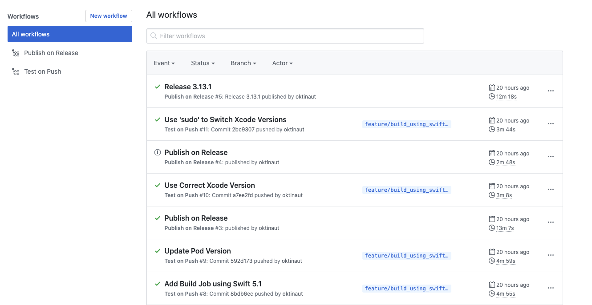
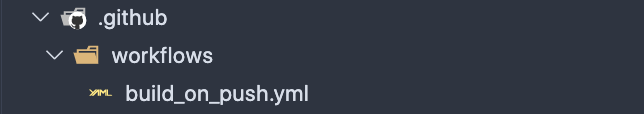
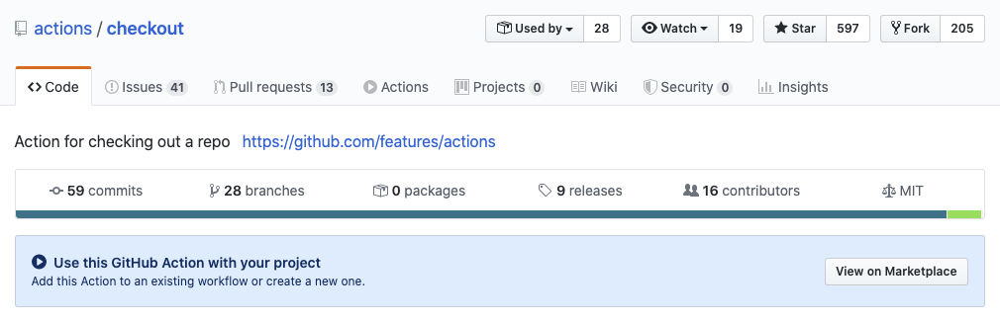
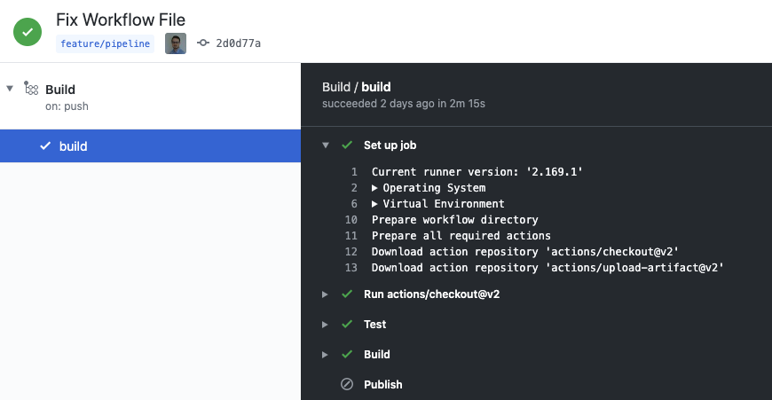
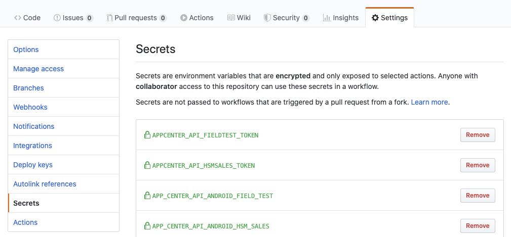
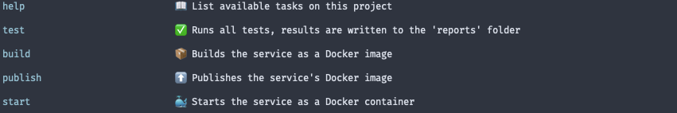

name: inverse
layout: true
class: center, middle, inverse
---

.title-label[
    ## Kata
]
# Continuous Integration <br>with Github Actions

---

# What is Github Actions?

---
layout: false
.left-column[
## What is Github Actions?
### &bull; Introduction
]
.right-column[
Github Actions provides a declarative way to integrate automation tasks per repository.

Configuration files are just commited into the respective repository and as such can be easily edited by every collaborator.

Common use-cases include:
* Testing

* Building and publishing artifacts

* Generating documentation

* Sending notifications on new versions, e.g. as Slack messages
]

---
layout: false
.left-column[
## What is Github Actions?
### &bull; Introduction
]
.right-column[
The Actions UI is integrated into Github and reachable from any Repository by clicking on the "Actions"-tab:


]

---
layout: false
.left-column[
## What is Github Actions?
### &bull; Introduction
]
.right-column[
Github Actions runs fully in the cloud, but provides you with escape hatches to host your on job runners.

This can be useful if services are deployed in a private network or jobs involve running tests on hardware devices.

Pricing might be an issue, too. While runners are available for the major OSs,
Mac OS build minutes are four times more expensive than those on Linux.
]

---
name: inverse
layout: true
class: center, middle, inverse
---

# How does it work?

---
layout: false
.left-column[
## How does it work?
### &bull; Workflows
]
.right-column[
Entrypoint into each CI process are `yaml`-files called workflows.

Github automatically picks up on any workflow file under `.github/workflows/`:



Each file consist of one ore more triggers, which define the behavior of when certain jobs should be run.

These jobs in return are composed of several steps.
]

---
layout: false
.left-column[
## How does it work?
### &bull; Workflows
]
.right-column[
Simple example of a workflow file:
```yaml
# workflow name
name: Test on Push

# workflow is executed on every push to a feature branch
on:
  push:
    branches:
      - feature/*

# jobs are run independently of one another
jobs:
  test:
    # target machine on which job is run
    runs-on: ubuntu-latest
    steps:
      # step runs a premade Action to checkout the repo
      - uses: actions/checkout@v2
      # custom steps that run in a shell
      - name: Install Dependencies
        run: |
          make dependencies.install
      - name: Run Tests
        run: |
          make test
```
]

---
layout: false
.left-column[
## How does it work?
### &bull; Workflows
### &bull; Actions
]
.right-column[
Single steps can be developed in isolation and packaged as so-called "Actions".


]

---
layout: false
.left-column[
## How does it work?
### &bull; Workflows
### &bull; Actions
]
.right-column[
Actions are reusable components for workflows, which can be semantically versioned.

This prevents breaking workflows should a major update occur on one of your actions.

```yaml
steps:
  # Actions are references by their repository name
  # and version tag
  - uses: actions/checkout@v2
  # You can optionally name a step that uses an Action,
  # otherwise the Action name is displayed
  - name: Checkout Repository
```
]

---
layout: false
.left-column[
## How does it work?
### &bull; Workflows
### &bull; Actions
### &bull; Control Flow
]
.right-column[
Steps are executed in sequential order.

If one step fails, the following steps are skipped and the job is marked as failed.

The execution of steps and their logs can be viewed on the repository's page:


]

---
layout: false
.left-column[
## How does it work?
### &bull; Workflows
### &bull; Actions
### &bull; Control Flow
]
.right-column[
It is possible to run steps only on positive evaluation of a condition:

```yaml
# Runs the steps only on the 'develop' branch
- name: Run Tests
  if: github.ref == 'refs/heads/develop'
  run: |
    make test
```

You can also run a step always, regardless if previous steps have failed (the job will still be shown as unsuccessful):

```yaml
# Runs the steps even if previous steps failed
- name: Send Report to Slack
  if: ${{ always() }}
  run: |
    make slack.send_report
```
]

---
layout: false
.left-column[
## How does it work?
### &bull; Workflows
### &bull; Actions
### &bull; Control Flow
### &bull; Secrets
]
.right-column[
Secrets can be safely stored per repository and referenced in workflow steps.



There are additional secrets that are automatically injected for each job,
the most frequently used being `GITHUB_TOKEN`.

`GITHUB_TOKEN` authenticates the actor running the jobs against Github APIs, e.g. for publishing packages.
]

---
layout: false
.left-column[
## How does it work?
### &bull; Workflows
### &bull; Actions
### &bull; Control Flow
### &bull; Secrets
]
.right-column[
Example of using the `GITHUB_TOKEN` secret to login to Docker private docker registry:

```yaml
jobs:
  build:
    runs-on: ubuntu-latest
    steps:
      - name: Login to Docker Registry
        uses: azure/docker-login@v1
        with:
          login-server: docker.pkg.github.com
          username: $GITHUB_ACTOR
          # Access the Github actor's access token
          password: ${{ secrets.GITHUB_TOKEN }}
```
]

---
name: inverse
layout: true
class: center, middle, inverse
---

# Kata

---
layout: false
.left-column[
## Kata
### &bull; Prerequisites
]
.right-column[
There aren't any requirements aside from having Git installed.

If you want to run the project's tasks locally, make sure you have the following installed as well:

* make

* Docker

To get started fork the following repository:

https://github.com/oktinaut/kata-github-actions
]

---
layout: false
.left-column[
## Kata
### &bull; Prerequisites
### &bull; Project
]
.right-column[
This project includes a simple Node.js server application.

It is our goal to automate tasks such as testing and building.

To help you getting started, the necessary tasks are already included in the project.

Run `make` inside the projects root folder to get a listing of all available tasks:



Use `make <task-name>` to execute one.
]

---
layout: false
.left-column[
## Kata
### &bull; Prerequisites
### &bull; Project
### &bull; Tasks
]
.right-column[
**Exercise 1**

* Create a job that tests and build the application

* This job should run if changes are pushed to both the `develop` and `feature/` branches

* **BONUS:** Add a badge to display the build status in the projects `README.md`

* **BONUS:** Find a way to upload the test results as artifacts to Github

**Exercise 2**

* Create a job that publishes the server as a Docker image to the Github Packages registry

* This job should run on just the `develop` branch

* **BONUS:** Using conditional steps, integrate it all into the job from **exercise 1**
]

---
layout: false
.left-column[
## Kata
### &bull; Prerequisites
### &bull; Project
### &bull; Tasks
### &bull; Resources
]
.right-column[
Github Actions Reference:

https://help.github.com/en/actions/reference/workflow-syntax-for-github-actions

https://help.github.com/en/actions/reference/events-that-trigger-workflows

Collection of Actions by Github:

https://github.com/actions

Marketplace for custom Actions:

https://github.com/marketplace
]

---
name: inverse
layout: true
class: center, middle, inverse
---

# Happy Hacking!

